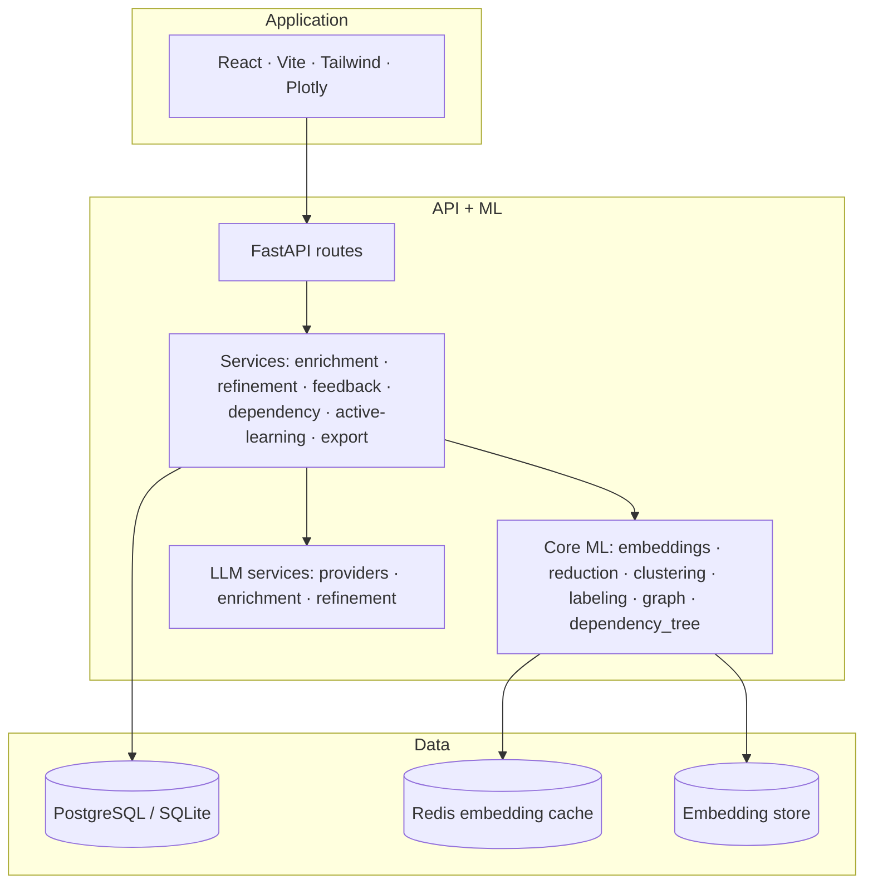
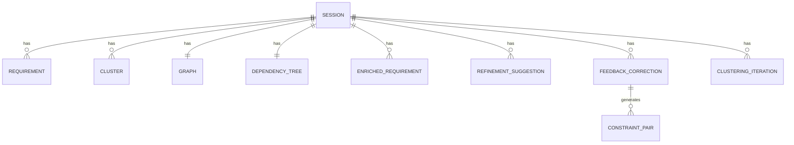
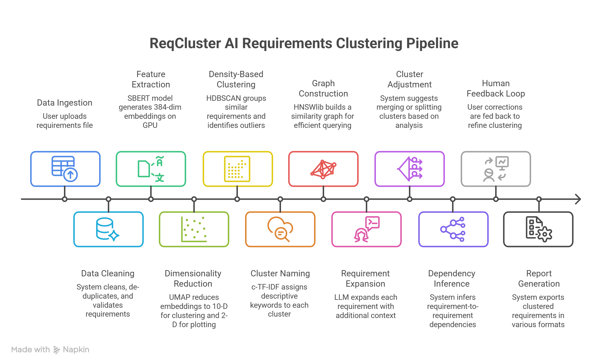
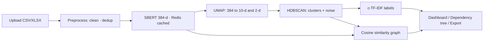

# ReqCluster

**AI-assisted requirements engineering.** Upload a messy CSV or XLSX of engineering
requirements and ReqCluster groups them by meaning, infers the dependencies
between them, explains every grouping, lets analysts correct it, and exports the
result into the tools teams already use - all of it deterministic and able to run
fully offline.

Built for the **Honeywell Hackathon, problem statement DP5** ("Grouping
Functionally Related Requirements"): a categorized list, a dependency diagram,
and a rationale document, with no manual intervention required to produce them.

```
CSV / XLSX  ->  preprocess  ->  SBERT embeddings  ->  UMAP  ->  HDBSCAN  ->  c-TF-IDF labels
                                       |                                          |
                                       +------------>  similarity graph  <--------+
                                                              |
                            dependency tree + rationale  ·  dashboard  ·  export (PDF / ReqIF / SysML / Jama / CSV)
```

---

## Contents
- [Why it exists](#why-it-exists)
- [What it does](#what-it-does)
- [Architecture](#architecture)
- [The pipeline](#the-pipeline)
- [Quick start](#quick-start)
- [How to test](#how-to-test)
- [Configuration](#configuration)
- [API reference](#api-reference)
- [Datasets](#datasets)
- [Scalability](#scalability)
- [Project structure](#project-structure)

---

## Why it exists

A serious aerospace or automotive program carries **500 to 50,000** requirements,
written by many teams over years. Someone still has to sort them by hand, and that
is slow (8-12 hours per 500), inconsistent (two analysts agree only ~60% of the
time, Cohen's kappa), and incomplete (cross-cutting links get missed).

Existing tools each solve one slice and stop there:

- **DOORS / Jama** store and version requirements but do not cluster anything.
- **k-means / LDA** need a preset cluster count and ignore domain meaning.
- **LLM prompting** is non-deterministic, manual, and lives outside the RE workflow.

ReqCluster is the missing middle: automatic, explainable, repeatable,
human-supervised, and it exports back into DOORS, Jama, and SysML tools.

---

## What it does

| Capability | Summary |
|---|---|
| **Clustering pipeline** | SBERT embeddings -> UMAP reduction -> HDBSCAN density clustering -> c-TF-IDF labels -> cosine similarity graph. Deterministic, noise-aware. |
| **Dependency tree + rationale (DP5)** | Hierarchical / sequential / data / reference edges inferred from each requirement's inputs, pre-conditions, and outputs, rendered as an interactive 2D/3D graph, plus a generated rationale document. |
| **LLM enrichment (Phase 2)** | Optionally expand requirements with domain context before embedding ("base", "enriched", or "hybrid" modes) with comparison + ablation metrics. |
| **ClusterLLM refinement (Phase 3)** | Automatic merge/split suggestions with silhouette and bimodality analysis; accept/reject with an audit log. |
| **Human in the loop (Phase 4)** | Manual cluster corrections that generate must-link / cannot-link constraints; a review queue with approve/reject. |
| **Active learning (Phase 5)** | Constraints fed back into a constrained re-cluster; uncertainty-sampled review queue; quality tracked across iterations. |
| **Export** | **PDF report**, ReqIF 1.2, SysML/UML XMI, Jama bundle, and CSV. |
| **On-prem LLM** | Summaries / rationales via a local open-source model (Qwen via Ollama) or any OpenAI-compatible endpoint, with a deterministic mock fallback. No data leaves your network. |

---

## Architecture

Three tiers, each independently testable.



Data model (core tables):



| Layer | Tech |
|---|---|
| Backend | Python 3.10+, FastAPI, Uvicorn |
| ML | sentence-transformers (SBERT), UMAP, HDBSCAN, scikit-learn |
| LLM | mock (offline default), local (Ollama), OpenAI-compatible |
| Database | PostgreSQL (production) / SQLite (local fallback), SQLAlchemy |
| Cache | Redis per-text embedding cache (file fallback) |
| Frontend | React, Vite, TailwindCSS, Plotly.js (WebGL) |
| Export | reportlab (PDF), stdlib XML (ReqIF/XMI), JSON (Jama) |

---

## The pipeline





- **SBERT (`all-MiniLM-L6-v2`)** turns each requirement into a 384-dim vector; similar meaning gives similar vectors.
- **UMAP** reduces to 10-d (for clustering) and 2-d (for the scatter plot).
- **HDBSCAN** finds dense groups automatically (no preset count) and marks outliers as noise (`-1`).
- **c-TF-IDF** names each cluster with its most distinctive words.
- **Cosine similarity** links related requirements into a graph and underpins dependency inference.

---

## Quick start

Two terminals. **Use `uv run`** for the backend (it selects the project's Python
and avoids the Windows torch DLL issue).

### Backend
```bash
uv sync
cd backend
uv run uvicorn main:app --reload --port 8000
```
First clustering run downloads the SBERT model (~80 MB) once. With no
`DATABASE_URL` set, the backend uses a local SQLite file (a startup warning makes
this explicit).

### Frontend
```bash
cd frontend
npm install
npm run dev
```
Open **http://localhost:5173** (API docs at **http://localhost:8000/docs**).

### Docker (Postgres + Redis + backend + frontend)
```bash
docker compose up --build
```
Open **http://localhost:3000**.

### Try it
Upload `data/aerospace_requirements.csv`, run clustering, then explore
**Overview -> Scatter -> Graph -> Dependency Tree -> Review Queue -> Active
Learning -> Export** (download the **PDF report**).

---

## How to test

```bash
# full backend suite (offline, deterministic - no model download, no network)
uv run pytest -q

# with coverage
uv run pytest --cov=backend --cov-report=term-missing

# frontend build
cd frontend && npm run build
```

- Tests mock the embedding model (`tests/conftest.py`) so they run offline and
  fast; real UMAP/HDBSCAN run when installed.
- `.github/workflows/ci.yml` runs the backend suite and the frontend build on
  every push/PR.
- To verify the real pipeline end-to-end on a large set, generate a dataset and
  run it (see [Datasets](#datasets) / [Scalability](#scalability)).

---

## Configuration

| Variable | Purpose | Default |
|---|---|---|
| `DATABASE_URL` | PostgreSQL DSN; unset = local SQLite | unset (SQLite) |
| `REDIS_URL` | Redis for the embedding cache; unset = file cache | unset |
| `CORS_ORIGINS` | Comma-separated allowed origins | `http://localhost:5173,http://localhost:3000` |
| `REQCLUSTER_LLM_PROVIDER` | `mock` (default, offline), `local`, or `openai` | `mock` |
| `REQCLUSTER_LOCAL_LLM_URL` / `_MODEL` | Local LLM endpoint + model (e.g. Ollama, `qwen2.5`) | unset |
| `REQCLUSTER_LLM_BASE_URL` / `_API_KEY` / `_MODEL` | OpenAI-compatible gateway | unset |
| `JAMA_BASE_URL` / `JAMA_API_TOKEN` / `JAMA_PROJECT_ID` | Jama export target | unset |

With nothing configured, everything runs offline via the deterministic mock provider.

---

## API reference

| Method | Endpoint | Description |
|---|---|---|
| POST | `/api/upload` | Upload CSV/XLSX; returns session id + dedup stats |
| POST | `/api/cluster` | Run the clustering pipeline (base / enriched / hybrid) |
| GET | `/api/progress/{session_id}` | Poll pipeline progress |
| GET | `/api/sessions` · `/api/sessions/{id}` | List / get sessions |
| GET | `/api/clusters` · `/api/cluster/{id}` | Clusters / cluster detail |
| GET | `/api/graph` · `/api/requirements` | Similarity graph / requirements |
| POST | `/api/enrich` · GET `/api/enrich/status/{id}` · `/api/enrich/results` | LLM enrichment (Phase 2) |
| POST | `/api/suggestions/generate` · `/api/suggestions/apply` · GET `/api/suggestions` · `/api/suggestions/audit` | Refinement (Phase 3) |
| POST | `/api/feedback/submit` · `/api/feedback/review` · GET `/api/feedback/queue` · `/api/feedback/constraints` · `/api/feedback/export` | Human-in-the-loop (Phase 4) |
| POST | `/api/dependencies/generate` · GET `/api/dependencies` | Dependency tree + rationale (DP5) |
| POST | `/api/cluster/constrained` · GET `/api/active-learning/queue` · `/api/quality/history` | Active learning (Phase 5) |
| GET | `/api/export/{pdf\|reqif\|sysml\|jama\|csv}?session_id=` | Export the result |

Full interactive docs at `/docs` (Swagger).

---

## Datasets

| File | Rows | Notes |
|---|---|---|
| `data/sample_requirements.csv` | 119 | Original sample, 6 domains. |
| `data/aerospace_requirements.csv` | 64 | 8 subsystems with intentional dependency structure (cross-references, sequential pre-conditions, producer/consumer links). Best for the dependency tree + export. Regenerate with `python data/generate_aerospace_dataset.py`. |

**Real public requirements datasets for evaluation** (research-licensed, cite the
sources): **PROMISE NFR** (625 labelled requirements), **PURE** (79 public SRS
documents, thousands of requirements), and **Dronology** (UAV requirements with
ground-truth trace links - ideal for validating the dependency tree). Export any
of them to a CSV with at least a `text` column and upload; the preprocessor
auto-detects common column-name variants.

---

## Scalability

The pipeline is **size-adaptive**: small datasets take the exact, deterministic
path; large ones automatically switch to the fast parallel/approximate path.

**Implemented**

- **Adaptive reduction:** for N > ~4000, UMAP drops the fixed seed to run
  multi-threaded, a PCA pre-step (384 -> ~50) denoises and shrinks the cost, and
  the expensive kNN graph is computed once and shared by both the 10-d and 2-d
  embeddings. A cuML (GPU) path is used automatically when a CUDA device is
  present. Small N keeps the seeded, reproducible path.
- **ANN similarity graph:** edges are built with hnswlib approximate kNN over
  *all* non-noise nodes (O(N log N)), not a dense O(N^2) matrix capped to the
  first 500 - with a bounded exact fallback if hnswlib is missing.
- **PostgreSQL** with connection pooling and indexed hot query paths (SQLite is
  the zero-setup local fallback, WAL enabled).
- **Redis** per-text embedding cache - add new requirements without re-embedding
  the existing ones; file-cache fallback when Redis is absent.
- **Async background clustering job** with live progress polling.
- Server-side paginated / filterable requirements reads; WebGL (`scattergl`)
  scatter rendering.
- 140+ automated tests, green in CI; one-command Docker Compose stack.

### Performance (measured)

Measured on a 12-core CPU laptop + RTX 2050 (4 GB). Each number is the **min/max
of repeated runs**. Two definitions:

- **Best** = warm process, all CPU cores, idle machine.
- **Worst** = cold start (SBERT load ~4s + numba JIT ~8s, one-time) **plus** a
  single CPU core (a busy / constrained machine).

**1) Time to output — full pipeline (seconds)**

| Requirements | **CPU best → worst** | **GPU best → worst** |
|--:|--:|--:|
| 500 | 4 → 17 | 4 → 16 |
| 1,000 | 8 → 20 | 7 → 19 |
| 5,000 | 23 → 43 | 15 → 35 |
| 10,000 | 41 → 71 | 26 → 55 |
| 35,000 | 105 → 139\* | 46 → 80\* |
| 50,000 | 146 → 188\* | 65 → 108\* |

"GPU" = embeddings on the RTX 2050, UMAP/clustering on CPU (GPU clustering needs
cuML / Linux-WSL). \* 35k/50k worst extrapolates single-core reduce (≈1.6× all-core).

**2) Per-stage building blocks (measured, the numbers above are composed from these)**

| N | embed CPU | embed GPU | reduce all-core | reduce 1-core |
|--:|--:|--:|--:|--:|
| 500 | 0.9s | 0.13s | 3.5s | 3.8s |
| 1,000 | 1.8s | 0.27s | 6.4s | 6.3s |
| 5,000 | 8.9s | 1.3s | 13.6s | 21.0s |
| 10,000 | 17.9s | 2.7s | 23.3s | 38.8s |
| 35,000 | 68.5s | 9.3s | 36.3s | ~58s |
| 50,000 | 94.3s | 13.5s | 51.4s | ~82s |

(`reduce` = UMAP + HDBSCAN + ANN graph. HDBSCAN+graph are <5s even at 50k;
embedding variance is tiny, ±5%.)

**What the numbers say:**
- **Embeddings are the biggest slice at scale** and are **GPU ≈ 7× CPU** (≈3,700 vs
  ≈540 req/s), so GPU roughly **halves** large runs (50k: 146 → 65s). The file/Redis
  cache makes re-runs embed-free.
- **UMAP dominates the compute**; parallel + PCA keep it near-linear (10k 23s, 35k
  36s, 50k 51s) instead of exploding. Parallel gives **~1.5-1.7×** over single core
  at these sizes; under 4,000 it's single-threaded by design (reproducible).
- **The graph is ANN / O(N log N)** — no quadratic blow-up.

### Accuracy & validation (measured)

Clusters are validated against ground-truth groups (the `module` column) via
`GET /api/metrics`, also shown in the UI (Overview → *Validation metrics*).
Accuracy = cluster **purity**; ARI / V-measure are external scores (0-1). On the
generated UAV-FMS datasets (ground-truth = subsystem):

| Dataset | Accuracy (purity) | ARI | V-measure | Silhouette | Noise |
|---|--:|--:|--:|--:|--:|
| 2k  | **98.3%** | 0.956 | 0.977 | 0.825 | 0.7% |
| 10k | **98.0%** | 0.893 | 0.951 | 0.544 | 4.6% |
| 35k | **95.7%** | 0.811 | 0.912 | 0.091 | 6.5% |

Full accuracy + per-stage and Intelligence-stage (enrichment/refinement/dependency)
timing tables, plus best/worst cases, are in **[metrics.md](metrics.md)**.

### Adaptive methods — what runs at each size & how to control it

| Input size N | Reduction method | Embedding | Determinism |
|---|---|---|---|
| < 4,000 | seeded single-threaded UMAP + PCA(>50) | CPU/GPU auto | reproducible |
| ≥ 4,000 | parallel UMAP (`n_jobs=-1`) + PCA + shared kNN | CPU/GPU auto | non-deterministic |
| CUDA + cuML present | GPU UMAP/HDBSCAN (`cuml`) | GPU | — |

| You want | How |
|---|---|
| See active device | `python backend/core/device.py` |
| GPU embeddings (~8×) | `pip install torch --index-url https://download.pytorch.org/whl/cu121` |
| GPU UMAP/HDBSCAN | install RAPIDS cuML (Linux/WSL) |
| Parallel UMAP for small N | `REQCLUSTER_SMALL_N=500` in `.env` |
| Force single-core | `NUMBA_NUM_THREADS=1` |
| Tune clustering | Upload-page params, or `POST /api/cluster {min_cluster_size, min_samples, similarity_threshold}` |

### Infrastructure

| Component | Role |
|---|---|
| **FastAPI + Uvicorn** | REST API; clustering runs as an async background job with live progress polling (the request returns immediately). |
| **PostgreSQL** | Primary datastore: `QueuePool` connection pooling, indexed hot query paths. Auto-falls back to **SQLite** (WAL mode) when `DATABASE_URL` is unset, for zero-setup local dev. |
| **Redis** | Per-text embedding cache (content-hash keyed); file-cache fallback when `REDIS_URL` is unset. |
| **Embedding store** | Embeddings persisted off-DB (`.npy`) rather than bloating rows. |
| **GPU (optional)** | cuML UMAP/HDBSCAN used automatically when a CUDA device is present; CPU path otherwise. |
| **Docker Compose** | One command brings up postgres + redis + backend + frontend (nginx). Backend image pre-downloads the SBERT model and has a healthcheck. |
| **CI** | GitHub Actions runs the backend test suite + the frontend build on every push/PR. |
| **LLM** | Offline-first: deterministic mock by default; optional local (Ollama) or OpenAI-compatible provider. No data leaves the network. |

### GPU acceleration (measured)

The pipeline auto-detects the accelerator (`backend/core/device.py`) and runs
embeddings on the GPU automatically when a CUDA build of torch is installed - no
code change. Measured here (RTX 2050 laptop, 4 GB, vs the 12-core CPU), encoding
`all-MiniLM-L6-v2`:

| N | CPU (12-core) | GPU (RTX 2050) | speedup |
|--:|--:|--:|--:|
| 2,000 | 4.6 s · 433 req/s | 0.55 s · 3,614 req/s | **8.4×** |
| 10,000 | 22.4 s · 447 req/s | 2.73 s · 3,664 req/s | **8.2×** |
| 50,000 | ~112 s (extrapolated) | 13.8 s · 3,633 req/s | **~8×** |

Embeddings go from ~440 to ~3,650 req/s. On a datacenter GPU (L4 / A100) expect
20-40×. (Batch past 128 didn't help on 4 GB - the run is model-bound.)

**Check and enable GPU on your machine:**
```bash
python backend/core/device.py                 # reports GPU, driver, and whether torch can use it
# if it says "torch is CPU-only", install a CUDA build matching your driver:
pip install torch --index-url https://download.pytorch.org/whl/cu121
python scripts/benchmark_embeddings.py --device cuda --n 10000   # verify
```
Embeddings then run on the GPU automatically. **GPU UMAP/HDBSCAN (cuML/RAPIDS) is
Linux-only** - on Windows use WSL2; the CPU path remains the default everywhere.

**Remaining roadmap**

- Memory-mapped embeddings instead of in-RAM arrays for very large N.
- ONNX-runtime embeddings for a faster CPU encode path.
- Cluster-level aggregate graph view for the dashboard at 50k+.

Target: 500k requirements, ~10s clustering, on GPU hardware.

---

## Project structure

```
reqcluster/
  backend/
    main.py                 FastAPI app + lifespan
    api/routes.py           all REST endpoints
    core/                   ML: embeddings, embedding_cache, reduction, clustering,
                            labeling, graph, dependency_tree, representatives,
                            merge_suggest, split_suggest, constrained_clustering,
                            active_learning, feedback_bridge, domain_embeddings,
                            ablation, embedding_comparison, preprocessing, pipeline
    services/               enrichment · refinement · feedback · dependency ·
                            active_learning · export
    llm_services/           providers (mock/local/openai) · enrichment · refinement
    export/                 reqif · sysml_xmi · jama · pdf_report
    models/                 database (SQLAlchemy) · schemas (Pydantic)
  frontend/src/
    pages/                  Upload · Overview · Scatter · Graph · Requirements ·
                            ClusterDetail · Enrichment · Refinement · ReviewQueue ·
                            DependencyTree · ActiveLearning · Export
    components/ · utils/
  data/                     sample datasets + generator
  tests/                    pytest suite (offline-mocked)
  docker-compose.yml · Dockerfile.backend · Dockerfile.frontend · nginx.conf
```

---

Phase 1 (core pipeline + dashboard), Phase 2 (LLM enrichment), Phase 3 (refinement),
Phase 4 (human-in-the-loop), and Phase 5 (active learning, MBSE + PDF export,
scalability) are implemented. Everything runs offline by default; no API keys
required.
