# ReqCluster — Architecture & Flow Reference

A complete, diagram-driven explanation of the platform: system tiers, the full
ML pipeline, every phase (1 through 5 + the Honeywell DP5 deliverables), the
data model, the API surface, and the module dependency graph.

> Edge convention in dependency diagrams: `A --> B` means *A is a prerequisite
> of B* (B depends on A).

---

## 1. System architecture (three tiers)

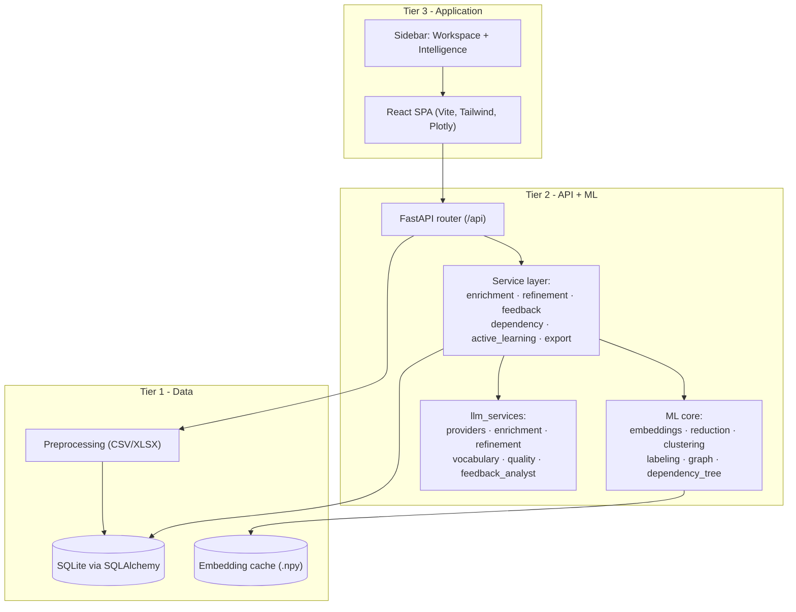

---

## 2. End-to-end workflow (what a user does)

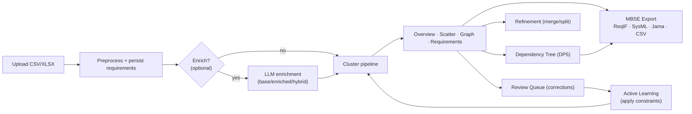

---

## 3. The core ML pipeline (Phase 1, `core/pipeline.py`)

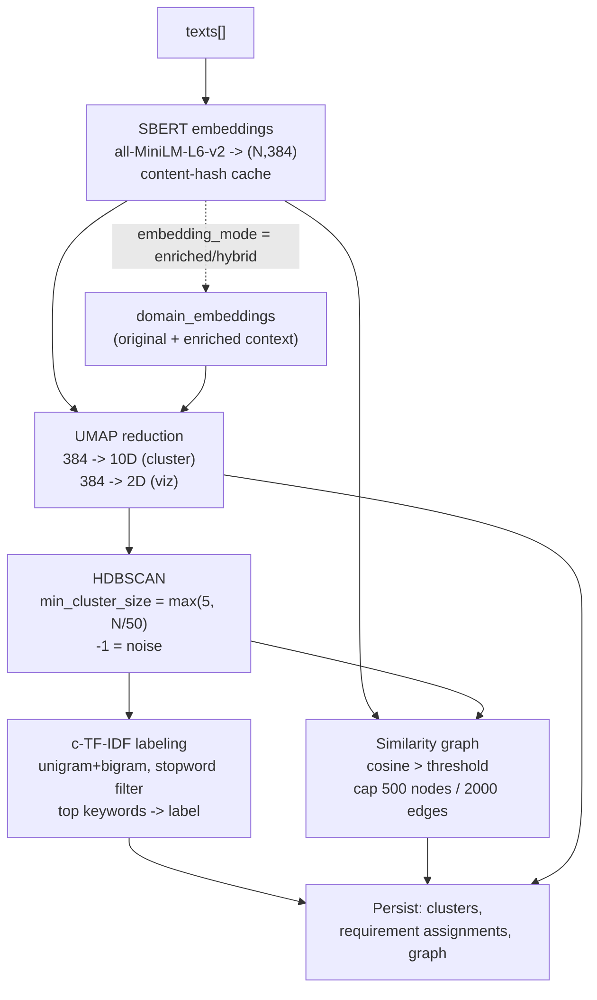

Progress is reported step-by-step (`embedding -> umap -> clustering -> labeling
-> graph -> done`) and polled by the UI; the heavy work runs in a threadpool so
the event loop stays responsive.

---

## 4. Phase 2 — LLM semantic enrichment

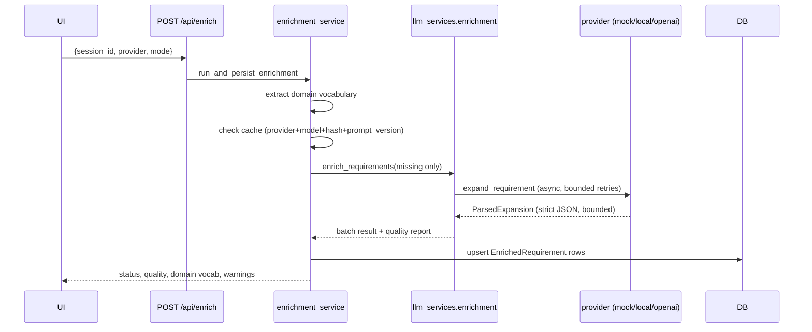

Clustering can then use `base`, `enriched`, or `hybrid` embeddings;
`enable_embedding_comparison` and `run_ablation` produce comparison metrics.

---

## 5. Phase 3 — ClusterLLM refinement

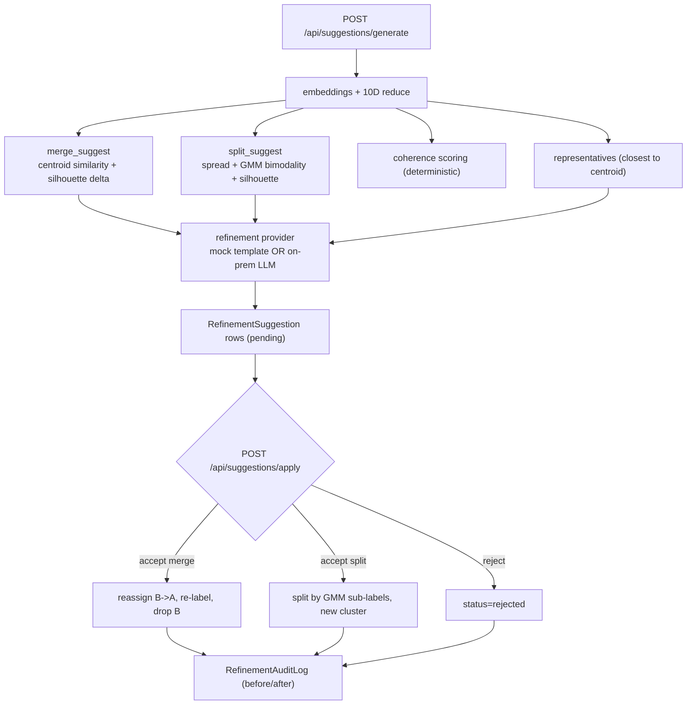

---

## 6. Phase 4 + Phase 5 — Human-in-the-loop and active-learning loop

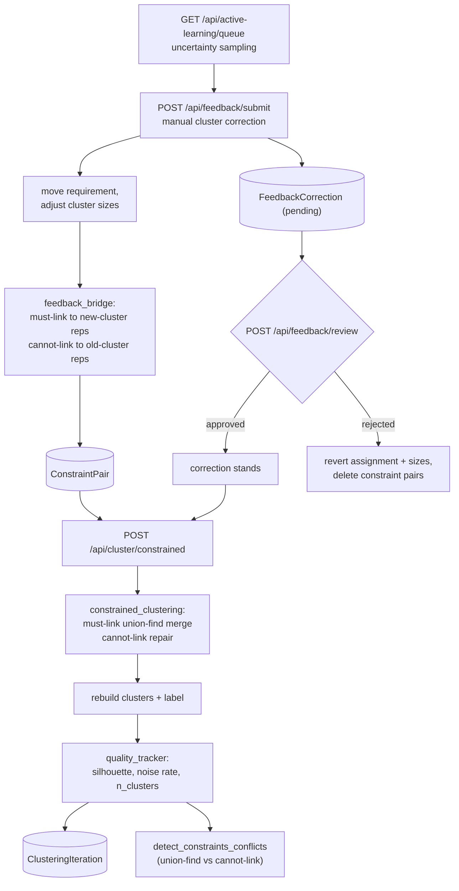

The loop closes: corrections become constraints, constraints re-shape the
clustering, quality is tracked across iterations, and the uncertainty queue
feeds the next round of corrections.

---

## 7. DP5 — Dependency tree inference

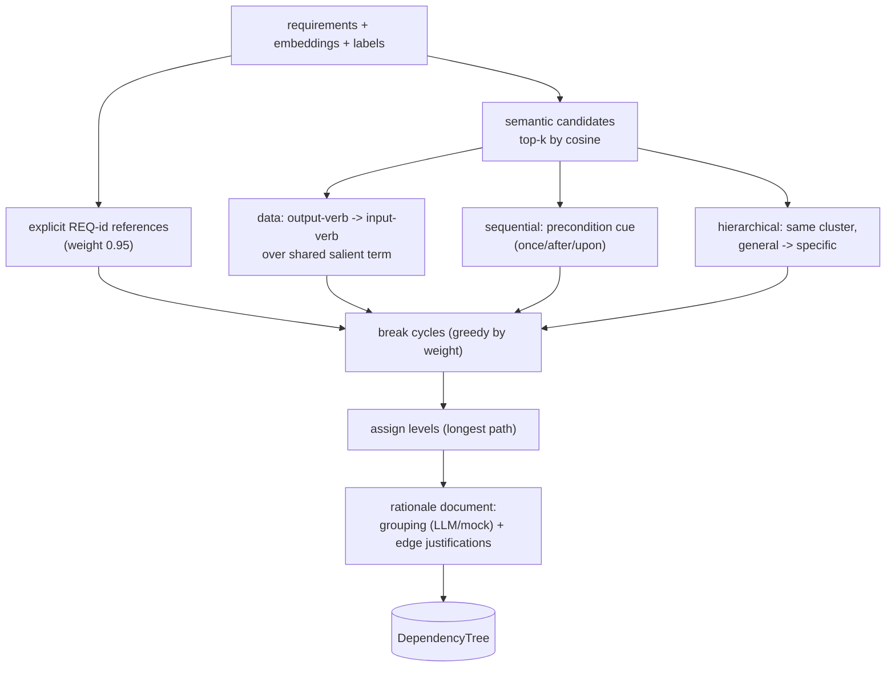

---

## 8. MBSE export (Phase 5)

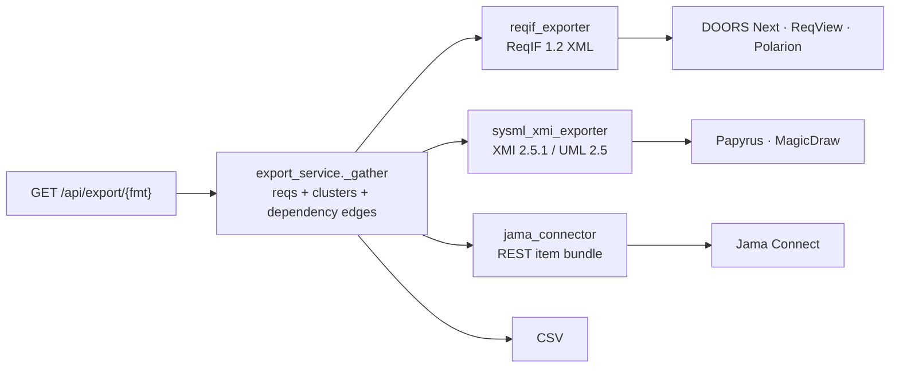

---

## 9. Data model (SQLAlchemy)

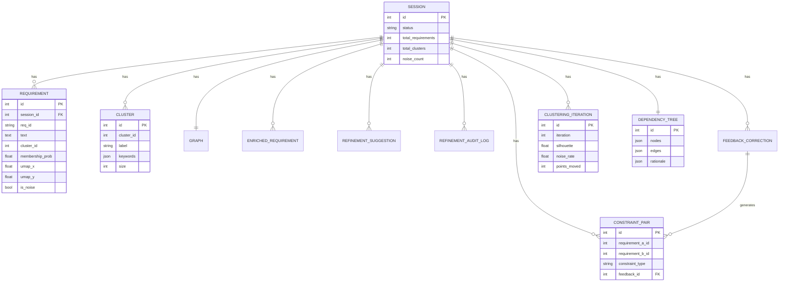

---

## 10. API surface

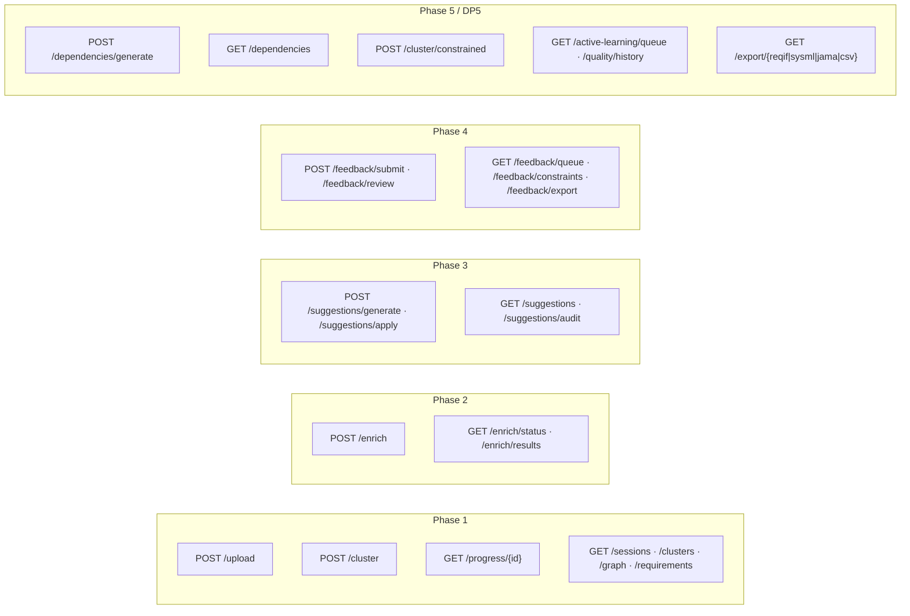

---

## 11. Backend module dependency graph

```mermaid
flowchart TB
    routes["api/routes.py"] --> es["services/enrichment_service"]
    routes --> rs["services/refinement_service"]
    routes --> fs["services/feedback_service"]
    routes --> ds["services/dependency_service"]
    routes --> als["services/active_learning_service"]
    routes --> xs["services/export_service"]
    routes --> pipe["core/pipeline"]
    routes --> pre["core/preprocessing"]

    pipe --> emb["core/embeddings"]
    pipe --> dom["core/domain_embeddings"]
    pipe --> red["core/reduction"]
    pipe --> clu["core/clustering"]
    pipe --> lab["core/labeling"]
    pipe --> grp["core/graph"]
    pipe --> abl["core/ablation"]
    pipe --> cmp["core/embedding_comparison"]

    ds --> deptree["core/dependency_tree"]
    ds --> reps["core/representatives"]
    ds --> llmref["llm_services/refinement"]
    rs --> ms["core/merge_suggest"]
    rs --> ss["core/split_suggest"]
    rs --> reps
    rs --> llmref
    als --> cc["core/constrained_clustering"]
    als --> alm["core/active_learning"]
    fs --> fb["core/feedback_bridge"]
    fs --> fa["llm_services/feedback_analyst"]
    es --> llmenr["llm_services/enrichment"]
    llmenr --> prov["llm_services/providers"]
    llmref --> prov
    xs --> rfx["export/reqif_exporter"]
    xs --> sxm["export/sysml_xmi_exporter"]
    xs --> jmc["export/jama_connector"]

    deptree --> emb
    dom --> emb
```

---

## 12. Provider model (offline-first)

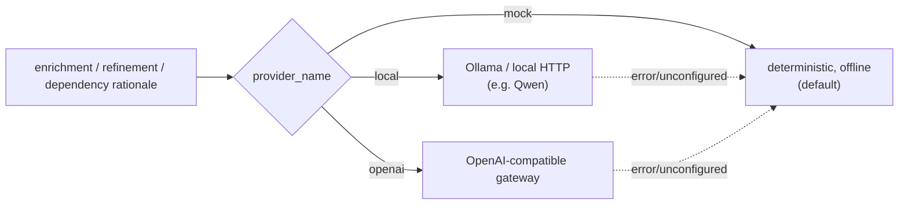

Everything runs offline by default; LLM output is strictly parsed and bounded,
and any provider failure falls back to the deterministic path.

---

## 13. Code-review knowledge graph

A graphify-generated knowledge graph of the backend (519 nodes, 994 edges, 31
labelled communities) is checked in under `graphify-out/`:

- `graphify-out/graph.html` — interactive graph, open in any browser.
- `graphify-out/GRAPH_REPORT.md` — audit report (god nodes, surprising
  connections, suggested questions).
- `graphify-out/graph.json` — raw graph data (GraphRAG-ready).

The communities recovered by the graph match the intended module boundaries
(LLM provider & enrichment, domain embeddings & ablation, MBSE export,
dependency tree, refinement, constrained clustering, preprocessing, etc.),
which is a good structural-cohesion signal. The most-connected "god node" is
`normalize_plain_text()` (the shared sanitizer used across the LLM layer).
