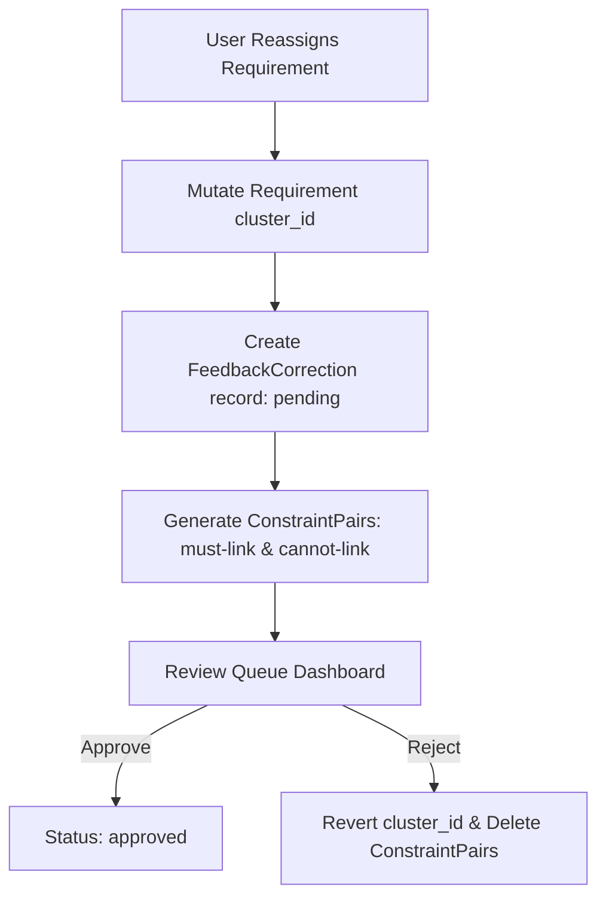

# Phase 4 — Human-in-the-Loop System

Phase 4 introduces human supervision and feedback to the requirements clustering process. It enables systems engineers and analysts to manually adjust requirement cluster assignments, annotate adjustments with descriptions and confidence levels, and automatically extract machine-learning constraints (must-link and cannot-link pairs) to prepare for future active learning pipelines.

---

## 1. Overview & Architecture

When an analyst reassigns a requirement to a different cluster:
1. The **Requirement** table is immediately mutated inside a database transaction to keep the UI highly responsive and consistent.
2. A **FeedbackCorrection** record is created in a `pending` state.
3. The **Review Queue** acts as an audit log and control dashboard where adjustments can be finalized (**Approved**) or rolled back (**Rejected**).
4. If an adjustment is rejected, the requirement is reverted to its `previous_cluster_id`, and all associated machine-learning constraints are deleted.

---

## 2. Database Schema

Two new tables are introduced to track human adjustments and machine-learning constraints:

### `FeedbackCorrection`
Tracks the history and metadata of human reassignments.
* `id` (Integer, Primary Key)
* `session_id` (Integer, Indexed)
* `requirement_id` (Integer, Indexed)
* `previous_cluster_id` (Integer, Nullable)
* `new_cluster_id` (Integer, Nullable)
* `confidence_score` (Float, 0.0 to 1.0)
* `comments` (Text, Nullable)
* `applied_by` (String, Nullable, Analyst Identity)
* `status` (String: `pending`, `approved`, `rejected`)
* `created_at` / `updated_at` (DateTime)

### `ConstraintPair`
Logs pairwise constraints extracted from manual adjustments to feed into downstream semi-supervised clustering.
* `id` (Integer, Primary Key)
* `session_id` (Integer, Indexed)
* `requirement_a_id` (Integer, Indexed)
* `requirement_b_id` (Integer, Indexed)
* `constraint_type` (String: `must-link` or `cannot-link`)
* `feedback_id` (Integer, Indexed, links to `FeedbackCorrection`)
* `created_at` (DateTime)

---

## 3. ML Constraint Generation & Conflict Detection

### Constraint Extraction (To Prevent Bloat)
Moving a requirement to a cluster of size $M$ could theoretically generate $M$ pairwise constraints, leading to quadratic database bloat. To avoid this, constraints are only generated against the **top 3 representative requirements** of the source and target clusters (determined by proximity to the cluster's UMAP centroid):
* **Must-Link**: Created between the adjusted requirement and the top 3 representatives of the *target* cluster.
* **Cannot-Link**: Created between the adjusted requirement and the top 3 representatives of the *source* cluster.

### Conflict Detection (Union-Find)
Active constraints (where the parent feedback is not rejected) are analyzed for transitivity conflicts using a **Disjoint-Set (Union-Find)** data structure:
* All `must-link` pairs are merged into disjoint sets representing equivalence classes of requirements that must reside together.
* The system then checks if any `cannot-link` constraint exists between requirements in the *same* disjoint set.
* Any violations are flagged as active conflicts in the **Review Queue** validation banner.

---

## 4. LLM Semantic Feedback Analyst

The semantic feedback analyzer ([feedback_analyst.py](file:///c:/Users/Ryan/Desktop/reqcluster/backend/llm_services/feedback_analyst.py)) supports two features:
1. **Dynamic Confidence Estimation**: Analyzes natural language comments (e.g. *"This fits better with thermal control circuits"*) and compares them against target cluster keywords and TF-IDF terms to compute a semantic matching confidence level (ranging between 0.5 and 1.0) when offline.
2. **Narrative Updater**: Restructures and updates summarized cluster descriptions to reflect the addition or removal of requirements.

---

## 5. API Endpoints

The backend exposes 5 REST API endpoints:

| Method | Endpoint | Description |
|---|---|---|
| `POST` | `/api/feedback/submit` | Submits a manual cluster reassignment and generates constraints. |
| `GET` | `/api/feedback/queue` | Retrieves all pending/reviewed feedback records for a session. |
| `POST` | `/api/feedback/review` | Approves or Rejects a pending adjustment (rejection triggers rollback). |
| `GET` | `/api/feedback/constraints` | Lists active constraint pairs and returns a validation conflict report. |
| `GET` | `/api/feedback/export` | Downloads the review queue in CSV or JSON format. |

---

## 6. Frontend UI Components

### Reassignment Modals & Actions
* **Requirements Page** & **Cluster Detail Page**: Feature a new **Reassign** button for each requirement.
* **MoveToClusterModal**: Captures the target cluster (including noise `-1`), confidence level (50-100%), comments, and the analyst's name (which is cached in local storage).

### Scatter Plot Visual Highlighting
* Requirements with active corrections are displayed on the **Scatter Plot** with larger markers and distinct border rings:
  * **Blue**: Pending review.
  * **Green**: Approved.
  * **Red**: Rejected.
* Clicking a highlighted marker opens the inspector sidebar containing full feedback history and comments.

### Review Queue Dashboard
* Presents overall metrics (Pending, Approved, Rejected, and Constraints count).
* Displays a **Validation Alerts Banner** showing active ML conflicts.
* Offers tabbed tables for pending reviews and history logs.
* Incorporates inline expanders to read requirement text and quick actions to **Approve** or **Reject** adjustments.
* Provides a dropdown to export annotations as **CSV** or **JSON**.
